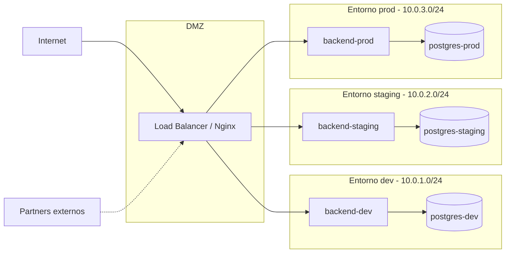

# Arquitectura de red - GreenDevCorp

> **Owner:** Persona A
> **Estado:** TODO
>
> Objetivo: visualizar la segmentacion logica de la red de la empresa
> mostrando entornos (dev/staging/prod), zonas (DMZ/internal/database)
> y conexiones externas (internet, partners).

## Diagrama

> Sustituye este placeholder por un diagrama Mermaid o ASCII art.
> Mermaid se renderiza directo en GitHub. Ejemplo de esqueleto:

## Componentes

> TODO: por cada zona, decir que vive ahi, que puede recibir y a que puede llamar.

- **DMZ (Demilitarized Zone):** ...
- **Entorno dev:** ...
- **Entorno staging:** ...
- **Entorno prod:** ...
- **Partners externos:** ...

## Flujos de trafico

> TODO: enumerar los flujos validos. Ejemplos:
> - Internet -> LB en DMZ (HTTPS 443)
> - LB -> backend-prod (HTTP 3000)
> - backend-prod -> postgres-prod (TCP 5432)
> - dev <-> staging: prohibido
> - prod <-> dev: prohibido
