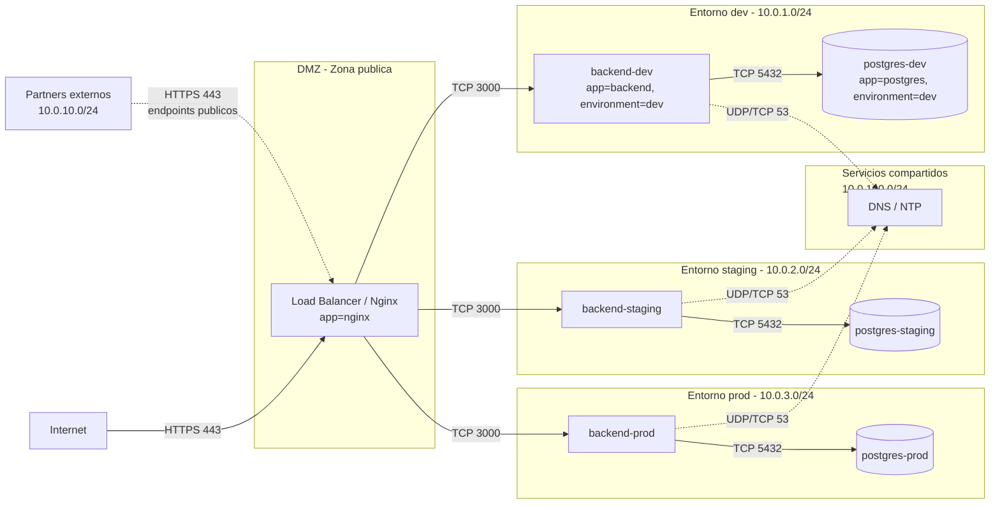

# Arquitectura de red - GreenDevCorp

> **Owner:** Persona A
> **Estado:** Implementado

Objetivo: visualizar la segmentacion logica de la red de la empresa
mostrando entornos (dev/staging/prod), zonas (DMZ/internal/database)
y conexiones externas (internet, partners).

## Diagrama

## Componentes

- **DMZ (Demilitarized Zone):** unico nginx (load balancer + reverse proxy)
  expuesto a internet via NodePort 30080. Recibe trafico publico, lo termina
  y lo enruta al backend del entorno correspondiente. No tiene acceso directo
  a las bases de datos.
- **Entorno dev:** backend (app, NodeJS, puerto 3000) + postgres (5432).
  Pods etiquetados con `environment=dev`. Recibe trafico solo desde nginx.
- **Entorno staging:** identico a dev pero con label `environment=staging`.
  Aislado de dev y prod por NetworkPolicies.
- **Entorno prod:** identico, label `environment=prod`. Idealmente en un
  cluster fisicamente separado en escenario real; en la demo Minikube
  comparte cluster pero no flujos de red.
- **Servicios compartidos (DNS/NTP):** kube-dns (coredns) en
  `kube-system`. Cualquier pod necesita egress a este servicio para
  resolver nombres; lo abre la policy `05-allow-dns.yaml`.
- **Partners externos:** subred dedicada `10.0.10.0/24`. Acceso solo a
  endpoints publicos via DMZ, nunca directo a backends ni databases.

## Flujos de trafico permitidos

| Origen          | Destino         | Protocolo | Justificacion                  |
|-----------------|-----------------|-----------|--------------------------------|
| Internet        | Nginx (DMZ)     | HTTPS 443 | Trafico publico de usuarios    |
| Partners        | Nginx (DMZ)     | HTTPS 443 | API publica para integraciones |
| Nginx           | backend-dev     | TCP 3000  | Reverse proxy a app dev        |
| Nginx           | backend-staging | TCP 3000  | Reverse proxy a app staging    |
| Nginx           | backend-prod    | TCP 3000  | Reverse proxy a app prod       |
| backend-X       | postgres-X      | TCP 5432  | App accede a SU base de datos  |
| Cualquier pod   | kube-dns        | UDP/TCP 53| Resolucion DNS interna         |

## Flujos prohibidos (bloqueados por default-deny + ausencia de allow-rule)

- dev <-> staging (ambos sentidos, app y DB).
- dev <-> prod.
- staging <-> prod.
- backend-X -> postgres-Y (X != Y): un backend no puede tocar una DB ajena.
- Partners -> cualquier backend o DB directamente: solo via DMZ.
- nginx -> postgres-X: el frontend nunca habla directo con DB.
- Cualquier egress a internet desde backends: no abierto, default-deny corta.
