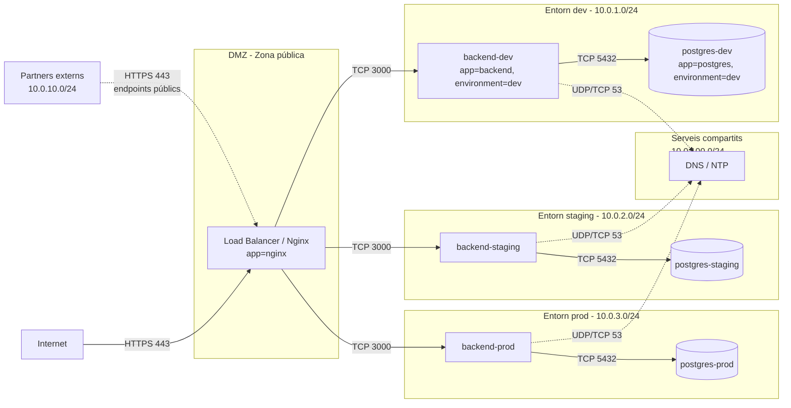

# Arquitectura de xarxa — GreenDevCorp

> **Estat:** Implementat

Objectiu: visualitzar la segmentació lògica de la xarxa de l'empresa
mostrant entorns (dev/staging/prod), zones (DMZ/interna/base de dades)
i connexions externes (internet, partners).

## Diagrama

## Components

- **DMZ (Demilitarized Zone):** únic nginx (load balancer + reverse proxy)
  exposat a internet via NodePort 30080. Rep tràfic públic, el termina
  i l'encamina al backend de l'entorn corresponent. No té accés directe
  a les bases de dades.
- **Entorn dev:** backend (app, NodeJS, port 3000) + postgres (5432).
  Pods etiquetats amb `environment=dev`. Rep tràfic només des de nginx.
- **Entorn staging:** idèntic a dev però amb label `environment=staging`.
  Aïllat de dev i prod per NetworkPolicies.
- **Entorn prod:** idèntic, label `environment=prod`. Idealment en un
  clúster físicament separat en un escenari real; a la demo Minikube
  comparteix clúster però no fluxos de xarxa.
- **Serveis compartits (DNS/NTP):** kube-dns (coredns) a `kube-system`.
  Qualsevol pod necessita egress a aquest servei per resoldre noms; ho
  obre la política `05-allow-dns.yaml`.
- **Partners externs:** subxarxa dedicada `10.0.10.0/24`. Accés només a
  endpoints públics via DMZ, mai directament als backends ni bases de dades.

## Fluxos de tràfic permesos

| Origen          | Destí           | Protocol  | Justificació                        |
|-----------------|-----------------|-----------|-------------------------------------|
| Internet        | Nginx (DMZ)     | HTTPS 443 | Tràfic públic d'usuaris             |
| Partners        | Nginx (DMZ)     | HTTPS 443 | API pública per a integracions      |
| Nginx           | backend-dev     | TCP 3000  | Reverse proxy a l'app dev           |
| Nginx           | backend-staging | TCP 3000  | Reverse proxy a l'app staging       |
| Nginx           | backend-prod    | TCP 3000  | Reverse proxy a l'app prod          |
| backend-X       | postgres-X      | TCP 5432  | L'app accedeix a LA SEVA base de dades |
| Qualsevol pod   | kube-dns        | UDP/TCP 53| Resolució DNS interna               |

## Fluxos prohibits (bloquejats per default-deny + absència de regla allow)

- dev <-> staging (ambdós sentits, app i DB).
- dev <-> prod.
- staging <-> prod.
- backend-X -> postgres-Y (X != Y): un backend no pot accedir a una DB aliena.
- Partners -> qualsevol backend o DB directament: només via DMZ.
- nginx -> postgres-X: el frontend mai parla directament amb la DB.
- Qualsevol egress a internet des dels backends: no obert, default-deny talla.
