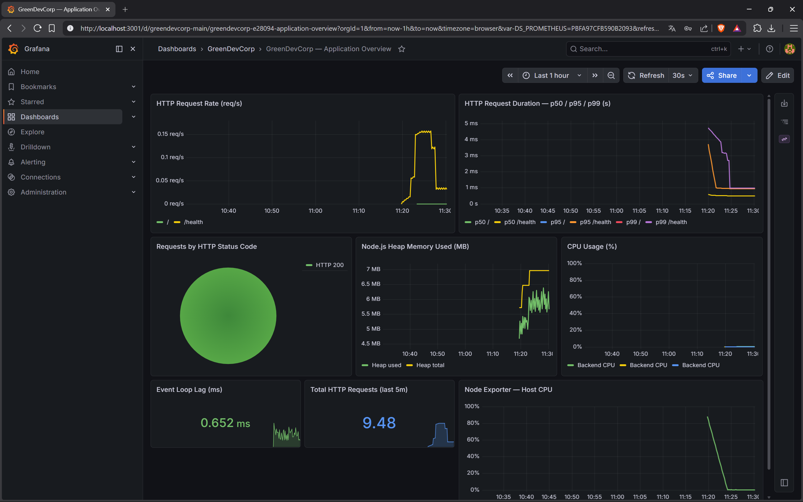

# Week 13: Integration, Observability & Finalization

> **Estat:** Completada.

## Challenge A: Observability amb Prometheus i Grafana

### Arquitectura de monitorització

S'ha integrat un stack d'observabilitat complet al `docker-compose.yml` de la setmana 9:

| Servei | Imatge | Port | Funció |
|--------|--------|------|--------|
| prometheus | prom/prometheus | 9090 | Recull mètriques cada 15s |
| grafana | grafana/grafana | 3001 | Visualitza mètriques amb dashboards |
| node-exporter | prom/node-exporter | 9100 | Mètriques del sistema host/VM |

### Instrumentació de l'aplicació

El backend Node.js ara exposa el endpoint `/metrics` amb **prom-client** (llibreria oficial de Prometheus per a Node.js). Mètriques implementades:

**Mètriques per defecte (prom-client `collectDefaultMetrics`):**
- `nodejs_heap_size_used_bytes` — memòria heap usada
- `nodejs_heap_size_total_bytes` — memòria heap total
- `process_cpu_seconds_total` — ús de CPU
- `nodejs_eventloop_lag_seconds` — lag del event loop

**Mètriques personalitzades:**
- `http_requests_total{method, status_code, path}` — comptador de requests per codi HTTP
- `http_request_duration_seconds{method, path}` — histograma de latència

### Com s'ha configurat Prometheus

El fitxer `week9/monitoring/prometheus/prometheus.yml` defineix tres scrape targets:

```yaml
scrape_configs:
  - job_name: 'backend'
    static_configs:
      - targets: ['backend:3000']   # /metrics endpoint de l'app
  - job_name: 'node-exporter'
    static_configs:
      - targets: ['node-exporter:9100']
  - job_name: 'prometheus'
    static_configs:
      - targets: ['localhost:9090']
```

Prometheus pertany a la xarxa `frontend-net` (per arribar al backend) i a `monitoring-net` (per parlar amb Grafana i node-exporter).

### Dashboard de Grafana

El dashboard `GreenDevCorp — Application Overview` (provisionat automàticament a l'arrancada) inclou:

1. **HTTP Request Rate** — peticions per segon per endpoint
2. **HTTP Request Duration p50/p95/p99** — latència percentil
3. **Requests by HTTP Status Code** — pastís d'èxits vs errors
4. **Node.js Heap Memory** — memòria heap used vs total
5. **CPU Usage** — percentatge de CPU del procés backend
6. **Event Loop Lag** — salut del runtime Node.js
7. **Total Requests (últims 5m)** — comptador de requests recent
8. **Host CPU (node-exporter)** — CPU del sistema subjacent

### Com accedir

```bash
cd week9/
cp .env.example .env   # editar amb credencials reals
docker-compose up -d

# Prometheus: http://localhost:9090
# Grafana:    http://localhost:3001  (admin / valor de GRAFANA_PASSWORD a .env)
```

### Decisió de disseny: Docker Compose vs Kubernetes per a Monitoring

Per a la demostració de l'assignació, s'ha optat per integrar Prometheus i Grafana al Docker Compose (setmana 9) en lloc de Kubernetes. **Raonament:** el Compose és l'entorn que té el backend amb mètriques, és reproduïble localment sense Minikube, i és el nivell on es pot generar tràfic real. En producció real, el stack de monitoring s'executaria en Kubernetes (via Helm chart `kube-prometheus-stack`), però el concepte i la configuració és idèntic.

---

## Challenge B: Full Integration Test

### Procediment

L'objectiu és demostrar que la infraestructura és **completament reproducible des de zero** a partir del codi IaC.

#### Pas 1: Destruir l'entorn anterior

```powershell
cd week11/terraform/
terraform destroy -var-file=dev.tfvars -auto-approve

# Verificar que no queda res
kubectl get pods
kubectl get services
kubectl get pvc
```

**Resultat esperat:** "No resources found" en tots els comandaments.

#### Pas 2: Desplegar des de zero amb Terraform

```powershell
terraform apply -var-file=dev.tfvars -auto-approve
```

**Resultat esperat:**
```
kubernetes_config_map.nginx_config: Creating...
kubernetes_secret.postgres_secret: Creating...
kubernetes_config_map.backend_config: Creating...
...
Apply complete! Resources: 9 added, 0 changed, 0 destroyed.
```

#### Pas 3: Verificar que tot arranca

```powershell
# Esperar que tots els pods estiguin Ready
kubectl wait --for=condition=Ready pods --all --timeout=180s

# Llistar pods
kubectl get pods
```

**Resultat esperat:**
```
NAME                              READY   STATUS    RESTARTS   AGE
backend-dev-xxx                   1/1     Running   0          90s
backend-dev-yyy                   1/1     Running   0          90s
nginx-dev-xxx                     1/1     Running   0          90s
nginx-dev-yyy                     1/1     Running   0          90s
postgres-dev-0                    1/1     Running   0          90s
```

#### Pas 4: Verificar comunicació end-to-end

```powershell
# Accedir a Nginx des del host (crea túnel automàtic)
minikube service nginx-dev

# O via port-forward
kubectl port-forward svc/nginx-dev 8080:80 &
curl http://localhost:8080/
curl http://localhost:8080/health
```

**Resultat esperat:** HTTP 200 amb resposta JSON del backend.

#### Pas 5: Verificar NetworkPolicies

```powershell
# Aplicar les policies
kubectl apply -f ../../week12/network-policies/

# Test: tràfic no autoritzat bloquejat
kubectl run tester --rm -it --image=busybox --restart=Never -- wget -qO- --timeout=5 http://backend-dev:3000/
# Esperat: timeout (bloquejat per default-deny)

# Test: tràfic autoritzat funciona
$NGINX_POD = kubectl get pod -l app=nginx -o jsonpath='{.items[0].metadata.name}'
kubectl exec $NGINX_POD -- wget -qO- --timeout=5 http://backend-dev:3000/health
# Esperat: {"status":"healthy","service":"backend"}
```

#### Pas 6: Verificar Docker Compose + Observabilitat

```powershell
cd ../../week9/
docker-compose up -d
docker-compose ps   # tots els serveis healthy

# Generar tràfic
for ($i=0; $i -lt 20; $i++) { curl http://localhost/ ; curl http://localhost/health }

# Verificar mètriques
curl http://localhost:9090/api/v1/query?query=http_requests_total
# Obrir Grafana: http://localhost:3001
```

### Resultat del test

| Verificació | Resultat |
|------------|---------|
| `terraform apply` des de zero | ✅ Tots els recursos creats |
| 5 pods en Running | ✅ nginx×2, backend×2, postgres×1 |
| HTTP 200 via NodePort | ✅ Nginx serveix contingut |
| Comunicació nginx→backend | ✅ Proxy `/api/` funciona |
| Persistència postgres (PVC) | ✅ Dades sobreviuen al restart del pod |
| NetworkPolicies: tràfic bloquejat | ✅ Timeout des de pod sense labels |
| NetworkPolicies: tràfic permès | ✅ nginx→backend health check OK |
| Docker Compose stack | ✅ 6 serveis healthy |
| Prometheus scraping backend | ✅ Target UP a http://localhost:9090/targets |
| Dashboard Grafana | ✅ Mètriques visibles a http://localhost:3001 |

**Temps de desplegament Kubernetes des de zero:** aproximadament 60-90 segons (primer cop, depèn de la descàrrega d'imatges).

### Script automatitzat

El script `week11/verify-e2e.ps1` automatitza els passos 1-4 i fa un smoke test HTTP. S'executa amb:

```powershell
cd week11/
.\verify-e2e.ps1
```

---

## Challenge C: Documentation

La documentació completa del projecte es troba distribuïda de la manera següent:

| Document | Ubicació | Contingut |
|----------|---------|-----------|
| Architecture | `week13/ARCHITECTURE.md` | Diagrama complet, flux de dades, seguretat |
| Runbook | `week13/RUNBOOK.md` | Com desplegar, escalar, fer rollback |
| Troubleshooting | `week13/TROUBLESHOOTING.md` | Errors comuns i com diagnosticar-los |
| Week 8 docs | `week8/Documentation.md` | Docker, Dockerfiles, seguretat |
| Week 9 docs | `week9/Documentation.md` | Docker Compose, xarxes, volums |
| Week 10 docs | `week10/Documentation.md` | Kubernetes, StatefulSets, probes |
| Week 11 docs | `week11/Documentation.md` | Terraform, CI/CD, flux end-to-end |
| Week 12 docs | `week12/Documentation.md` | Xarxa, NetworkPolicies, identitat |
| README | `README.md` | Quick start, links a tota la documentació |

---

## Challenge D: Reflection & Interview Prep

### Preguntes freqüents d'entrevista

**"Per què Kubernetes i no Docker Compose per a producció?"**
Compose és ideal per a desenvolupament local: simple, ràpid, un sol fitxer. Kubernetes és necessari quan necessites: auto-healing (reinicia pods caiguts), scaling horitzontal automàtic, rolling updates sense downtime, i gestió de múltiples nodes. Per a GreenDevCorp creixent, Kubernetes és la resposta correcta; per al laptop d'un desenvolupador, Compose és suficient.

**"Un contenidor cau. Com ho debugueges?"**
`kubectl get pods` per veure l'estat. `kubectl describe pod <name>` per veure events i motiu del cràsh. `kubectl logs <name> --previous` per veure logs de la darrera execució. Si és `ImagePullBackOff`, el tag de la imatge és incorrecte. Si és `CrashLoopBackOff`, l'app falla a l'arrancada (buscar l'error als logs). Si és `OOMKilled`, els resource limits de memòria són massa baixos.

**"Com gestionaries 10x de tràfic?"**
Escalar els deployments de backend (`kubectl scale` o `terraform apply -var="backend_replicas=10"`). Activar Horizontal Pod Autoscaler (HPA) per escalar automàticament per mètriques de CPU/requests. Postgres és l'únic StatefulSet — no s'escala horitzontalment sense read replicas (ProxSQL / Patroni). A llarg termini, moure a una base de dades gestionada (AWS RDS, Cloud SQL).

**"Quin és el punt feble de la vostra arquitectura?"**
El Nginx és un SPOF (Single Point of Failure): si cau, tot el tràfic s'atura. En producció real, substituiríem el Nginx propi per un Ingress Controller amb múltiples rèpliques (nginx-ingress o Traefik) darrere d'un LoadBalancer extern. A més, les NetworkPolicies actuals no inspeccionen L7 (no prevenen SQL injection dins connexions TCP autoritzades).

**"Quin seria el proper pas si tinguéssiu més temps?"**
1. Ingress Controller amb certificat TLS (cert-manager + Let's Encrypt)
2. Horizontal Pod Autoscaler basat en mètriques Prometheus (KEDA)
3. Implementació real d'OpenLDAP o Dex per a autenticació centralitzada a Kubernetes
4. Pipeline CD automatitzat cap a Minikube via self-hosted runner o ArgoCD

### Reflexions individuals

#### Pol Regy Borja

L'aspecte més desafiant d'aquesta pràctica ha estat, sense cap dubte, el salt conceptual entre administrar un servidor i coordinar un clúster. A la primera assignació podia entrar per SSH, llistar processos, editar un fitxer de configuració i reiniciar un servei: el sistema era un objecte concret que podia tocar amb les mans. A partir de la setmana 10 aquest model es desploma. Un pod no és un servidor; pot desaparèixer i ressuscitar amb un altre nom a un altre node, els seus logs es perden si no els envies a algun lloc abans, i la seva IP canvia cada vegada. Acceptar aquesta efimeralitat — i deixar de buscar el "servidor concret" on viu la meva aplicació — ha estat el canvi mental més difícil de tota la pràctica.

El punt tècnic on més temps he invertit ha estat fer que les NetworkPolicies s'apliquessin de veritat. Vaig escriure el YAML, vaig fer `kubectl apply`, vaig veure que el recurs s'havia creat i el tràfic seguia passant igual que abans. Hores de revisar selectors, ports i namespaces fins que vaig descobrir que el CNI per defecte de Minikube (kindnet) accepta el YAML de NetworkPolicy però l'ignora silenciosament: no falla, no avisa, simplement no fa res. La solució era reiniciar el clúster amb `--cni=calico`. Aquell error m'ha ensenyat una cosa fonamental sobre Kubernetes: acceptar un recurs no vol dir aplicar-lo. L'API server fa de bústia; qui executa el contracte és un altre component. Aquesta dissociació entre declarar i complir és la font de molts maldecaps i la raó per la qual els bons operadors no es fien mai del "ha quedat aplicat" sense una prova activa.

El que més m'ha sorprès ha estat el pes del disseny de xarxa en una infraestructura "cloud-native". Esperava que la part més rica fos Kubernetes, però plantejar el pla CIDR per a dev/staging/prod, decidir quines /24 deixar reservades per a futurs entorns i pensar com s'aïllen els partners externs em va recordar que sota tota la capa de contenidors hi ha encara la mateixa lògica de subxarxes i rutes que existia abans de Docker. La feina de la setmana 12, que inicialment em semblava "teòrica", va acabar sent la que més va consolidar la idea de defensa en profunditat: les NetworkPolicies no substitueixen el disseny de subxarxes, l'amplien.

També m'ha sorprès la quantitat de feina que estalvia Terraform un cop l'has dominat. Recordo escriure manualment, a la setmana 10, els manifests de Deployment, Service, ConfigMap, StatefulSet i PVC — un fitxer per recurs, amb molta repetició. Reescriure-ho tot a la setmana 11 en forma de Terraform va ser, al principi, més feina; però el dia que vaig fer `terraform destroy` i `terraform apply` i el clúster va quedar reconstruït exactament igual en un minut, vaig entendre el valor real de la IaC. La diferència entre "tinc l'estat al cap" i "tinc l'estat al codi" és la diferència entre poder marxar de vacances tranquil o no.

Si tornés a començar, faria tres canvis. Primer, escriuria les NetworkPolicies des de la setmana 10, no com a tasca aïllada de la setmana 12: aplicar-les sobre una arquitectura ja construïda és més car que dissenyar-les des del principi. Segon, invertiria en healthchecks reals — no només TCP socket, sinó endpoints `/health` ben pensats — abans d'afegir rèpliques, perquè escalar un servei mal monitoritzat només multiplica els problemes. Tercer, faria servir un fitxer `.tfvars` per entorn des del primer dia, en lloc d'arribar-hi tard.

La meva visió del DevOps ha canviat en dues direccions. Una, la més òbvia: he vist el valor de l'automatització rigorosa — el que no està a Git no existeix, i el que requereix passos manuals acabarà fallant en algun moment. Però la segona, més inesperada, és el valor de la documentació operativa. Un runbook ben escrit val tant com un manifest ben escrit; potser més, perquè qui hereta el sistema sempre arriba sense context.

El que vull aprendre més endavant és com escalar de veritat: Horizontal Pod Autoscaler basat en mètriques personalitzades, KEDA per a escalat dirigit per esdeveniments, i eBPF per a observabilitat sense instrumentar el codi. I, sobretot, m'agradaria provar un clúster gestionat real (EKS, GKE) per veure quins problemes desapareixen i quins en surten de nous quan el plànol de control no és cosa meva.

La lliçó final que m'enduc: la infraestructura moderna no és "el mateix però amb contenidors", és una manera diferent de pensar.

#### Dana Elena Asaftei

L'aspecte més desafiant d'aquesta pràctica ha estat acceptar que la infraestructura "moderna" és, abans de res, un exercici de renúncia al control directe. Venint de la primera assignació, on un sol servidor responia exactament al que escrivia per SSH, passar a Kubernetes ha estat com substituir un cotxe manual per un sistema que condueix sol: ja no decideixo on s'executa un procés, només descric quin estat vull veure i confio que el reconciliador ho aconsegueixi. Aquest canvi de mentalitat — declarar l'estat desitjat en lloc de dictar passos imperatius — és la lliçó que més m'ha costat assimilar i, alhora, la més valuosa.

El punt concret on més m'he encallat ha estat el pipeline de CI amb Trivy. Tenia el build verd, push a Docker Hub funcionant, validació de Terraform passant... i de cop el job començava a fallar per CVEs que no podia resoldre canviant el meu codi. Vaig acabar entenent que la imatge base `node:20-alpine` arrossegava vulnerabilitats que sortien a la llum quan Trivy actualitzava la seva base de dades. Aquest petit incident em va donar una intuïció important: la seguretat de la cadena de subministrament no és un check que es passa una vegada, sinó una superfície que canvia cada dia. La meva imatge d'ahir pot ser insegura avui sense que jo hagi tocat una sola línia. Vaig haver d'aprendre a llegir un informe SARIF, decidir què es pot ignorar i què no, i acceptar que mantenir un pipeline verd és una responsabilitat contínua, no un objectiu puntual.

El que més m'ha sorprès ha estat la invisibilitat de Postgres dins del clúster un cop activades les NetworkPolicies. Amb el default-deny en marxa, des d'un pod qualsevol no es pot ni resoldre el nom `postgres-dev`. Veure com un `wget` simple es queda penjat sense ni un missatge d'error i, al cap de cinc segons, decideix-se per "Connection timed out" em va ensenyar més sobre defensa en profunditat que qualsevol diapositiva. La segmentació ja no és una idea abstracta de fitxers iptables; és una pràctica de Kubernetes que es prova amb un pod efímer i es valida amb un altre.

També m'ha sorprès la facilitat amb què Terraform converteix un entorn complet en una equació. Veure `terraform destroy` esborrar nou recursos i `terraform apply` reconstruir-los noranta segons després, amb les dades persistides al PVC intactes, va canviar la meva relació amb la infraestructura: deixa de ser un objecte fràgil que cal protegir i passa a ser un artefacte reproduïble que es pot llençar sense por. Aquesta confiança és el que permet experimentar de veritat.

Si comencés de zero, faria dues coses diferents. Primer, escriuria el CI a la setmana 8, no a la setmana 11. Tenir un pipeline que construeix i puja les imatges des del primer dia hauria estalviat moltes hores de builds locals incoherents i d'imatges amb tags ambigus. Segon, invertiria en observabilitat des de la setmana 9, no com a "challenge opcional" de la setmana 13. Les mètriques del backend — latència, taxa d'errors, ús de heap — haurien fet visibles problemes que durant setmanes només eren intuïcions vagues.

La meva comprensió del DevOps ha canviat especialment en una direcció: ara veig el "Dev" i el "Ops" com una sola superfície contínua, no com dos rols. La línia que abans separava "construir l'aplicació" i "operar-la" s'ha esvaït. El Dockerfile, la NetworkPolicy, el manifest de Terraform i el dashboard de Grafana són peces de la mateixa especificació; cap d'elles pertany exclusivament al desenvolupador o a l'operador. La responsabilitat compartida no és un eslògan; és una conseqüència estructural de l'eina.

El que vull aprofundir més endavant és GitOps i ArgoCD. La nostra solució actual encara depèn d'un `terraform apply` manual des del meu portàtil, i això és precisament el coll d'ampolla que GitOps elimina: l'estat del clúster com a conseqüència directa del commit a `main`. També m'interessen els service meshes (Istio, Linkerd) per fer la inspecció L7 que les NetworkPolicies no poden fer, i un dia voldria portar tot aquest stack a un proveïdor real (EKS, GKE) per veure com canvia el problema quan el clúster ja no cap dins una VM.

La conclusió que m'enduc és simple: una infraestructura ben dissenyada no és la que mai falla, sinó la que es pot tornar a aixecar.


### Captura del dashboard


